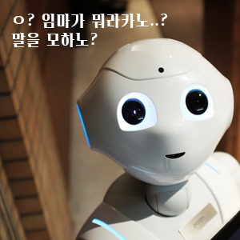

# 1.1 프로그래밍이란?
0과 1밖에 모르는 컴퓨터에게 우리가 원하는 행동을 명령 하는 대화이며, 사람과 다르게 논리적이며 수학적으로 사고를 분해하고 패턴화 하여 명확하게 수치화해서 정의하는(말해주는) 것 

~~마 컴퓨타야 니 이것좀 계산해도~~

# 1.2 프로그래밍 언어
사람이 기계어(비트로 되어있는 언어)를 이해하기는 너무 어렵기 때문에 컴파일러 혹은 인프리터(에디터툴이라고 이해하면되나?)에게 전달하는 언어 
ex) javascript, html, css

# 1.3 구문과 의미
프로그래밍은 올바른 문법은 물론 올바른 문맥을 사용해야한다. 
즉, 곱하기를 계산 할떄 숫자를 넣어야 하지 가,나 같은 글자를 쓰면 계산할수 있습니까...휴먼?